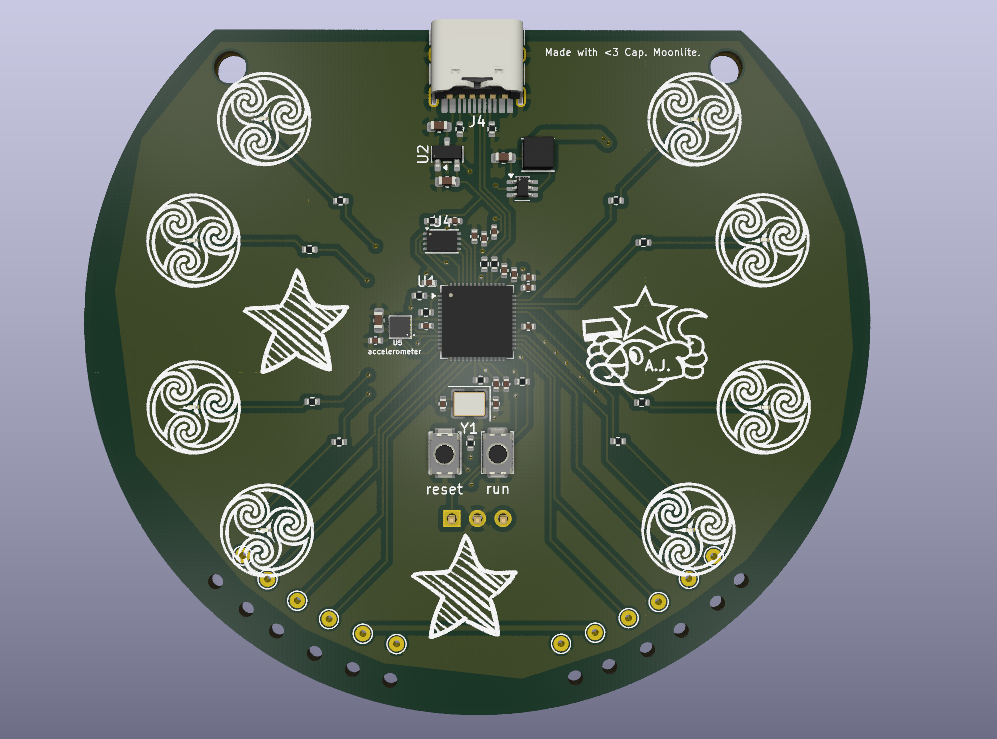
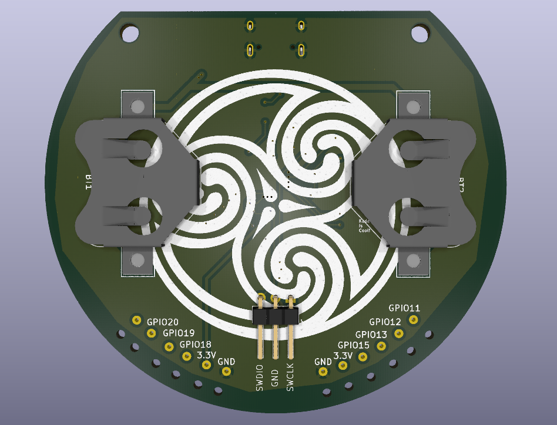

# Eimer
Eimer is a wearable RP2040 devboard!

## Features

A multi-axis accelerometer, 8 LEDs and 8 GPIO pads make Eimer an ideal wearable device. Solder pads are accompanied by holes to run the wire through, so there is no strain on the solder joint.

I designed Eimer to get more comfortable with SMD and to learn more about MCUs.

The name comes from Irish mythology.

## Assembly

All components can be soldered on a hotplate, except the coin cell holders which require hand-soldering.

## BOM

|Designator                                                                              |Footprint                                  |Quantity|Description|Suggested source|Total cost, £|
|----------------------------------------------------------------------------------------|-------------------------------------------|--------|---------------------------|-----------|--|
|BT1, BT2                                                                                |BatteryHolder_Multicomp_BC-2001_1x2032     |2       |CR2032 cell holder|https://www.aliexpress.com/item/1005010097971513.html|2.00|
|C1, C10                                                                                 |0402                                       |2       |1uF capacitor|https://www.aliexpress.com/item/32435282135.html|0.67|
|C11, C12, C17, C2, C21, C3, C4, C5, C6, C7, C8, C9                                      |0402                                       |12      |0.1uF capacitor|https://www.aliexpress.com/item/32435282135.html|0.67
|C13, C14, C19, C20                                                                      |0603                                       |4       |10uF capacitor|https://www.aliexpress.com/item/1005007404529007.html|1.83|
|C15, C16                                                                                |0402                                       |2       |33pF capacitor|https://www.aliexpress.com/item/1005002960548572.html|1.27|
|D1, D2, D3, D4, D5, D6, D7, D8                                                          |0201                                       |8       |LED green|https://www.aliexpress.com/item/1005007406675682.html|5.05|
|J3                                                                                      |PinHeader_1x03_P2.54mm_Horizontal          |1       |1x3 horizontal pin header| https://www.aliexpress.com/item/1005007569841697.html|0.55|
|J4                                                                                      |USB_C_Receptacle_HRO_TYPE-C-31-M-12        |1       |USBC Receptacle|https://www.aliexpress.com/item/1005008805157100.html|1.04|
|L1                                                                                      |L_APV_ANR3015                              |1       |4.7uH inductor|https://www.aliexpress.com/item/1005001699576419.html|1.14|
|R1, R2                                                                                  |0402                                       |2       |5.1K resistor|https://www.aliexpress.com/item/4001321720241.html (multipack includes all required resistor values)|1.86|
|R10, R11, R12, R13, R14, R15, R16, R17, R5, R6                                          |0402                                       |10      |1k resistor|-|-|
|R18, R7                                                                                 |0402                                       |2       |10k resistor|-|-|
|R3, R4                                                                                  |0402                                       |2       |27ohm resistor|-|-|
|R8, R9                                                                                  |0402                                       |2       |4.7k resistor|-|-|
|RESET, RUN                                                                              |SW_Push_SPST_NO_Alps_SKRK                  |2       |Push switch|https://jlcpcb.com/partdetail/XUNPU-TS_1088AR02016/C720477|1.00|
|U1                                                                                      |QFN-56-1EP_7x7mm_P0.4mm_EP3.2x3.2mm        |1       |RP2040 MCU chip|https://www.aliexpress.com/item/1005007275652762.html|3.46|
|U2                                                                                      |SOT-23                                     |1       |MCP1700x-330xxTT voltage regulator|https://www.aliexpress.com/item/32808973510.html|0.99|
|U3                                                                                      |Texas_R-PDSO-G6                            |1       |TPS61221DCK boost converter|https://www.aliexpress.com/item/1005012857789997.html|3.69|
|U4                                                                                      |Winbond_USON-8-1EP_3x2mm_P0.5mm_EP0.2x1.6mm|1       |W25Q16JVUXIQ TR flash memory|https://www.aliexpress.com/item/1005012822339773.html|5.55|
|U5                                                                                      |LIS2DW12                                   |1       |LIS2DW12 accelerometer|https://www.aliexpress.com/item/1005009164629980.html|3.22|
|Y1                                                                                      |Crystal_SMD_3225-4Pin_3.2x2.5mm            |1       |12 MHz crystal|https://www.aliexpress.com/item/1005005409440787.html|2.50|
|PCB|-|1|PCB|https://jlcpcb.com/|2.95|
|Total| | | | |39.44|
